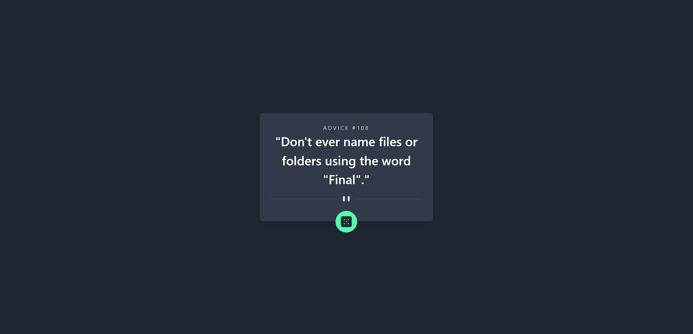
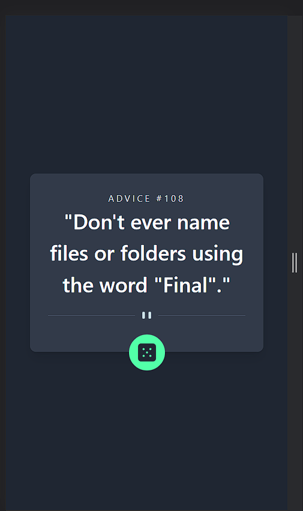

# Frontend Mentor - Advice generator app solution

This is a solution to the [Advice generator app challenge on Frontend Mentor](https://www.frontendmentor.io/challenges/advice-generator-app-QdUG-13db). Frontend Mentor challenges help you improve your coding skills by building realistic projects.

## Table of contents

- [Overview](#overview)
  - [The challenge](#the-challenge)
  - [Screenshot](#screenshot)
  - [Links](#links)
- [My process](#my-process)
  - [Built with](#built-with)
  - [What I learned](#what-i-learned)
  - [Continued development](#continued-development)
  - [Useful resources](#useful-resources)
- [Author](#author)

**Note: Delete this note and update the table of contents based on what sections you keep.**

## Overview

### The challenge

Users should be able to:

- View the optimal layout for the app depending on their device's screen size
- See hover states for all interactive elements on the page
- Generate a new piece of advice by clicking the dice icon

### Screenshot





### Links

- Solution URL: [solution URL](https://github.com/moniratna/advice-generator-frontend-mentor)
- Live Site URL: [live site URL](https://advice-generator-frontend-mentor-7ida.vercel.app/)

## My process

### Built with

- React.js
- TailwindCss
- Tailwind flex & Grid
- React-query for data fetching
- [React](https://reactjs.org/) - JS library
- [React-query](https://tanstack.com/query/v3/) - React-query
- [TailwindCss](https://tailwindcss.com/) - For styles

### What I learned

Learned React-query

```js
const { isLoading, isError, data, error, refetch } = useQuery(
	"quotes",
	getQuotes,
	{
		staleTime: Infinity,
	}
);
```

### Continued development

Need to update the hover effect on the dice button.

### Useful resources

- [React-Query](https://tanstack.com/query/v3/docs/react/overview) - This helped me to learn react-query. I will use it going forward.

## Author

- Website - [@Moniratna](https://github.com/moniratna)
- Frontend Mentor - [@Moniratna](https://www.frontendmentor.io/profile/moniratna)
